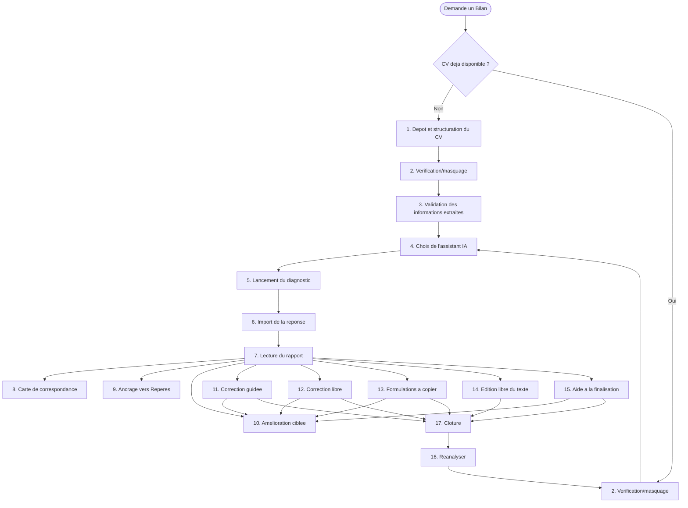

# Inventaire fonctionnel — Module Bilan de candidature

**Aucune modification de code, aucun refactoring, aucune proposition de correctif ou de nouvelle fonctionnalité dans ce document.** Uniquement un inventaire fonctionnel, orienté utilisateur, du module tel qu'il existe réellement au 2026-08-20 — basé sur une lecture directe du code (`js/app.js`, `data/metiers.js`, `modules/bilan-candidature/*`), recoupée avec les deux audits déjà menés (bugs de navigation, points de blocage).

---

## 1. Dépôt et structuration automatique du CV

- **Objectif** : transformer un CV déposé (texte collé, ou image/PDF) en informations structurées utilisables par l'application, sans ressaisie manuelle.
- **Moment** : au tout début, uniquement si la personne n'a pas encore de CV exploitable dans son dossier au moment de demander un Bilan.
- **Écrans** : fenêtre « Assistant de dépôt du CV » — étape 1 (déposer), étape 4 (coller la réponse d'extraction).
- **Fichiers/fonctions** : `ouvrirAssistantDepotCV()` (`data/metiers.js:1570`), prompt `prompts/extraction-cv.md`.
- **Entrées** : un CV brut (texte ou fichier).
- **Sorties** : les champs structurés du dossier (identité, expériences, expériences personnelles, formations, compétences, langues, certifications, logiciels, permis, loisirs, engagements).
- **Interaction IA** : oui, un aller-retour complet.
- **Dépendances** : condition d'entrée pour la fonction 3 ; indirectement, pour tout le reste du module (le diagnostic a besoin d'un dossier structuré).
- **Si elle disparaissait** : plus aucun moyen d'obtenir un Bilan sans avoir déjà un CV structuré par un autre biais (saisie manuelle) — perte du point d'entrée pour toute personne sans CV déjà présent dans l'application.

## 2. Vérification et masquage des informations avant envoi à l'IA

- **Objectif** : garantir que la personne garde le dernier mot sur ce qui part réellement vers un assistant IA externe — relire, corriger, masquer un nom ou des coordonnées avant l'envoi. Aucune anonymisation automatique n'est effectuée (jugée impossible à fiabiliser) ; la détection de coordonnées (email, téléphone) sert d'aide visuelle, pas de garantie.
- **Moment** : deux fois dans le parcours — avant l'envoi du CV pour extraction (fonction 1), et à nouveau avant le lancement du diagnostic (fonction 5).
- **Écrans** : « Vérifier le texte » (dans le dépôt de CV), « Relecture avant envoi » (avant le diagnostic).
- **Fichiers/fonctions** : composant partagé `htmlVerificationDocument()`/`cablerVerificationDocument()` (`data/metiers.js:1368+`) ; pour le Bilan spécifiquement, `bilanDemanderRelectureCv()`/`bilanAfficherEcranRelectureParDefaut()` (`modules/bilan-candidature/collecte/relectureConfidentialite.js`).
- **Entrées** : le texte du CV (brut ou déjà structuré selon le moment).
- **Sorties** : un texte validé par la personne, identique ou modifié/masqué — jamais transmis sans ce geste explicite (« Continuer » reste désactivé tant que « Enregistrer » n'a pas été cliqué).
- **Interaction IA** : aucune — étape 100 % locale, précède un envoi.
- **Dépendances** : bloque les fonctions 1 et 5 tant qu'elle n'est pas validée.
- **Si elle disparaissait** : un texte pourrait partir vers un assistant externe sans dernier regard de la personne — perte de la garantie de contrôle avant envoi, un principe explicitement posé dans le code (« aucune anonymisation automatique, la personne reste seule décisionnaire »).

## 3. Validation et correction des informations extraites du CV

- **Objectif** : permettre à la personne de vérifier, décocher ou corriger chaque information que l'IA a extraite de son CV avant qu'elle n'entre dans le dossier.
- **Moment** : juste après avoir collé la réponse d'extraction (fonction 1).
- **Écrans** : « Vérifiez les informations importées » (par catégories : identité, expériences, formations, compétences, loisirs/engagements/logiciels, autres informations).
- **Fichiers/fonctions** : écran d'import de l'étape 4 du dépôt de CV (`data/metiers.js`).
- **Entrées** : le JSON structuré renvoyé par l'IA.
- **Sorties** : les champs retenus et éventuellement corrigés, fusionnés dans le dossier.
- **Interaction IA** : aucune, uniquement de la lecture/correction manuelle du résultat déjà reçu.
- **Dépendances** : dépend de 1 ; alimente tout le reste du module.
- **Si elle disparaissait** : des informations mal lues ou incomplètes entreraient telles quelles dans le dossier, sans possibilité de les corriger avant qu'elles ne servent de base au diagnostic.

## 4. Choix de l'assistant IA

- **Objectif** : laisser la personne choisir avec quel assistant (Claude, ChatGPT, Gemini, Perplexity, Mistral — avec ou sans compte requis) elle va traiter cette étape.
- **Moment** : à chaque aller-retour IA du module (extraction, diagnostic, amélioration d'une recommandation, génération dans l'Aide à la finalisation).
- **Écrans** : « Choisissez votre assistant IA », sous deux formes différentes selon l'endroit — écran complet avec étapes numérotées « Ce qui va se passer » pour le diagnostic, pastilles simples dans une fenêtre modale pour l'extraction et l'amélioration d'une recommandation.
- **Fichiers/fonctions** : `lignePastillesAssistantsIA()` (`js/app.js:8446`, forme harmonisée) ; `cablerEtape3()` (`data/metiers.js:1831`, forme spécifique au dépôt de CV).
- **Entrées** : aucune (liste fixe `ASSISTANTS_IA`).
- **Sorties** : le prompt correspondant copié dans le presse-papiers, l'assistant choisi ouvert dans un nouvel onglet.
- **Interaction IA** : point de bascule vers l'IA externe, pas encore l'appel lui-même.
- **Dépendances** : nécessaire à toute fonction qui déclenche un aller-retour IA (1, 5, 10, 15).
- **Si elle disparaissait** : plus aucun moyen de déclencher un aller-retour IA — bloquerait tout le module.

## 5. Lancement du diagnostic de candidature

- **Objectif** : obtenir une évaluation de la candidature (CV + métier visé, éventuellement offre/entreprise ciblée) par un assistant IA, selon 10 dimensions fixes.
- **Moment** : une fois un CV disponible (déjà présent, ou juste structuré via 1+3).
- **Écrans** : « Bilan de candidature » (écran de choix de l'assistant pour le diagnostic).
- **Fichiers/fonctions** : `bilanDemarrerDiagnostic()` (`modules/bilan-candidature/core/moduleOrchestrator.js:89`), prompt `prompts/bilan-v1.md`.
- **Entrées** : le CV structuré et validé, le métier visé, l'offre/l'entreprise si fournies, des observations factuelles déjà calculées par l'application (déterministes, jamais laissées à l'IA).
- **Sorties** : un `Diagnostic` en attente de réponse.
- **Interaction IA** : oui, aller-retour complet.
- **Dépendances** : nécessite 1 (ou un CV déjà présent) et 2.
- **Si elle disparaissait** : le module perdrait sa raison d'être — plus aucun diagnostic possible.

## 6. Import de la réponse de diagnostic

- **Objectif** : récupérer la réponse de l'assistant et la transformer en diagnostic exploitable.
- **Moment** : juste après être revenu de l'assistant IA (fonction 5).
- **Écrans** : « Coller la réponse de l'assistant ».
- **Fichiers/fonctions** : `htmlBilanEtapeImportIA()` (`js/app.js:11302`), `bilanSoumettreReponseDiagnostic()` (`moduleOrchestrator.js`), `diagnosticResponseParser.js`.
- **Entrées** : le texte brut copié depuis l'assistant.
- **Sorties** : un diagnostic complet et structuré, ou un état d'échec de lecture avec message explicite et possibilité de recoller.
- **Interaction IA** : réception du résultat de l'aller-retour, pas un nouvel appel.
- **Dépendances** : dépend de 5 ; alimente 7.
- **Si elle disparaissait** : impossible de récupérer un diagnostic — le module s'arrêterait juste après l'envoi du prompt.

## 7. Lecture du rapport de diagnostic

- **Objectif** : présenter le diagnostic de façon lisible — alertes, synthèse générale, première impression, analyse par dimension, recommandations, projection recruteur.
- **Moment** : une fois le diagnostic complet.
- **Écrans** : « Rapport » (écran principal du Bilan).
- **Fichiers/fonctions** : `htmlBilanRapport()` (`js/app.js:11422-11597`).
- **Entrées** : le diagnostic structuré.
- **Sorties** : aucune, lecture seule.
- **Interaction IA** : aucune, affichage pur.
- **Dépendances** : nécessite 6 ; point de départ de 8, 9, 10, 11, 12, 13, 14, 15.
- **Si elle disparaissait** : le diagnostic obtenu ne serait jamais visible — toute la valeur du module disparaîtrait.

## 8. Carte de correspondance

- **Objectif** : montrer, pour l'axe Adéquation uniquement, quel élément de la candidature répond à quelle attente du poste — expliciter le « pourquoi » du diagnostic, pas seulement le « quoi ».
- **Moment** : en lisant le rapport, sur l'axe Adéquation.
- **Écrans** : bascule « Vue standard »/« Voir le raisonnement par attente », intégrée au Rapport.
- **Fichiers/fonctions** : `bilanRenduVueAttentes()` (`js/app.js:11399`), `modules/bilan-candidature/modeles/attente.js`, extension de `diagnosticResponseParser.js`.
- **Entrées** : les attentes et observations produites par le diagnostic (axe adequation).
- **Sorties** : aucune, lecture seule.
- **Interaction IA** : indirecte — les attentes sont produites par le même appel IA que le diagnostic (fonction 5), aucun appel dédié.
- **Dépendances** : dépend entièrement de 7 ; n'existe que si le diagnostic contient des attentes (absent sur un diagnostic ancien — message dédié dans ce cas).
- **Si elle disparaissait** : le rapport resterait fonctionnel ; seule cette lecture alternative de l'axe Adéquation disparaîtrait.

## 9. Ancrage d'un contenu vers Repères

- **Objectif** : garder un axe ou une recommandation comme « Repère » personnel, pour le retrouver et le retravailler plus tard dans le module Repères.
- **Moment** : en lisant le rapport, sur chaque axe et chaque recommandation.
- **Écrans** : bouton « Garder comme Repère » sur les axes et les recommandations du Rapport.
- **Fichiers/fonctions** : `reperesBoutonAncre()`/`reperesBrancherBoutonAncre()` (module Repères), appelées depuis `htmlBilanRapport()`.
- **Entrées** : le libellé de l'axe ou de la recommandation concernée.
- **Sorties** : un nouveau Repère créé dans le module Repères (hors Bilan).
- **Interaction IA** : aucune.
- **Dépendances** : dépend de 7 ; sort du module Bilan vers Repères, aucun retour prévu vers le Bilan.
- **Si elle disparaissait** : le Bilan resterait fonctionnel seul, mais perdrait son seul pont vers Repères.

## 10. Amélioration ciblée d'une recommandation (Prompt 2)

- **Objectif** : obtenir de l'IA une proposition de reformulation concrète pour UNE recommandation précise, sur demande explicite.
- **Moment** : depuis le rapport, sur une recommandation. Réutilisée en interne par 11, 12, 13, 15.
- **Écrans** : fenêtre « Améliorer cette recommandation » (choix IA) puis fenêtre de collage de la proposition.
- **Fichiers/fonctions** : `bilanOuvrirModaleAmelioration()` (`js/app.js:12585-12706`), `modules/bilan-candidature/amelioration/*`.
- **Entrées** : la recommandation concernée, un point particulier à travailler (texte libre optionnel).
- **Sorties** : une proposition de reformulation stockée temporairement (`_bilanPropositionsParRecommandation`), affichée ensuite dans le rapport et les parcours de correction.
- **Interaction IA** : oui, aller-retour complet, un par recommandation.
- **Dépendances** : dépend de 7 ; alimente l'affichage dans 7, 12, 13.
- **Si elle disparaissait** : plus de reformulation assistée par IA disponible — la personne devrait rédiger elle-même. Les fonctions 11, 12, 13, 15 perdraient leur mécanisme de génération commun.

## 11. Correction guidée — SUPPRIMÉE le 2026-08-27

Le mode « guidé » (séquence imposée, un point de recommandation à la fois) a été retiré : il n'avait plus aucun point d'entrée réel depuis RC-08 (la carte « J'écris avec mes mots » a toujours routé vers le mode libre). `htmlBilanCorrectionGuide()` / `brancherEvenementsCorrectionGuide()` et `parcoursCorrection.js` supprimés. Voir `docs/TACHES_VALIDEES.md` et `docs/LECONS_A_NE_PAS_REPRODUIRE.md` § 9.23.

## 12. Correction libre

- **Objectif** : même finalité que la correction guidée, mais sans ordre imposé — la personne choisit elle-même ce qu'elle traite et quand.
- **Moment/écrans** : « Correction libre ».
- **Fichiers/fonctions** : `htmlBilanCorrectionLibre()`/`brancherEvenementsCorrectionLibre()` (`js/app.js:12162-12216`).
- **Entrées/Sorties** : identiques à 11, sans contrainte d'ordre.
- **Interaction IA** : indirecte, via 10.
- **Dépendances** : dépend de 7.
- **Si elle disparaissait** : il resterait la correction guidée, plus contraignante pour qui ne veut pas suivre un ordre imposé.

## 13. Récupération de formulations à copier

- **Objectif** : obtenir une liste de formulations prêtes à copier-coller soi-même dans son CV, hors d'ERIP — le CV lui-même n'est jamais modifié par cette voie.
- **Écrans** : « Formulations à copier ».
- **Fichiers/fonctions** : `htmlBilanCorrectionCopier()`/`brancherEvenementsCorrectionCopier()` (`js/app.js:12222-12275`), réutilise 10.
- **Entrées** : les recommandations.
- **Sorties** : des propositions copiées, jamais appliquées automatiquement au dossier.
- **Interaction IA** : oui, via 10.
- **Dépendances** : dépend de 7 et 10 — c'est le même mécanisme que 10, présenté comme un mode de correction à part entière.
- **Si elle disparaissait** : la personne devrait passer par un mode qui modifie directement le dossier ERIP, même si elle rédige son CV ailleurs.

## 14. Édition libre du texte du CV — SUPPRIMÉE le 2026-08-27

Le mode « texte » (édition du CV en bloc de texte intégral) a été retiré : inatteignable depuis le 2026-08-24 (boucle auto-référente). Le cas « CV sans structure éditable » est déjà pris en charge à l'intérieur du mode libre, par `bilanDeclencherActionCorrection()` (branche `!dossierAStructureExperiences()`). `htmlBilanCorrectionTexte()` / `brancherEvenementsCorrectionTexte()` supprimés. Voir `docs/LECONS_A_NE_PAS_REPRODUIRE.md` § 9.23.

## 15. Aide à la finalisation du CV

- **Objectif** : pour une personne en difficulté avec l'autonomie rédactionnelle, laisser l'application enchaîner elle-même la génération des propositions pour plusieurs recommandations, avec relecture avant/après et application groupée dans le dossier.
- **Moment** : depuis le rapport, lien secondaire « J'ai besoin d'aide pour finaliser mon CV ».
- **Écrans** : classification des recommandations, génération (une à la fois), relecture avant/après, complément dans Mon projet si nécessaire, clôture.
- **Fichiers/fonctions** : `bilanOuvrirAssistanceFinalisation()` (`js/app.js:11714`), `modules/bilan-candidature/assistance/*`.
- **Entrées** : les recommandations du diagnostic.
- **Sorties** : des modifications appliquées directement au dossier, après validation explicite à l'écran de relecture.
- **Interaction IA** : oui, un aller-retour par recommandation traitée (réutilise 10 en interne).
- **Dépendances** : dépend de 7 ; peut rediriger vers « Mon projet » (hors module) pour les compléments qui ne sont pas de simples reformulations.
- **Si elle disparaissait** : la personne devrait obligatoirement traiter chaque recommandation via 11, 12, 13 ou 14 — perte de l'option la plus accompagnée pour le public le moins autonome.

## 16. Réanalyser la candidature

- **Objectif** : recommencer un diagnostic complet, typiquement après avoir appliqué des corrections, pour vérifier si elles ont amélioré le résultat.
- **Moment** : depuis l'écran de clôture (correction ou assistance).
- **Fichiers/fonctions** : bouton « Analyser à nouveau mon CV », `bilanRecommencerDiagnostic()`.
- **Entrées** : le CV tel qu'il est au moment du clic.
- **Sorties** : un nouveau cycle complet (retour vers 2 puis 5) ; réinitialise l'état de correction, mais pas les propositions déjà générées par 10 (jamais vidées).
- **Interaction IA** : ramène vers un nouvel aller-retour complet (fonction 5).
- **Dépendances** : accessible depuis 11/12/13/14 ou 15, via leur écran de clôture (17).
- **Si elle disparaissait** : il faudrait quitter et relancer tout le module manuellement depuis le début pour obtenir un nouveau diagnostic.

## 17. Clôture du parcours de correction/assistance

- **Objectif** : donner un point de fin clair et un message adapté à ce qui a réellement été fait, avant de proposer de réanalyser ou de revenir au rapport.
- **Écrans** : écran de clôture partagé par les 4 modes de correction, écran de clôture distinct pour l'assistance.
- **Fichiers/fonctions** : `htmlBilanCorrectionCloture()` (`js/app.js:11646`), `htmlBilanAssistanceCloture()` (`js/app.js:11961`).
- **Entrées** : le bilan des actions réellement effectuées (`_bilanStatutsCorrection`).
- **Sorties** : retour au rapport (7), ou déclenchement de 16.
- **Interaction IA** : aucune.
- **Dépendances** : dépend de 11/12/13/14 pour l'une, de 15 pour l'autre — deux implémentations distinctes pour un rôle similaire.
- **Si elle disparaissait** : chaque mode gérerait sa propre fin de parcours séparément, ou la personne resterait sans confirmation claire de fin.

---

## Tableau récapitulatif

| # | Fonction | Objectif | Position dans le parcours | Catégorie | Dépendances | Supprimable sans casser le reste ? |
|---|---|---|---|---|---|---|
| 1 | Dépôt et structuration du CV | Transformer un CV brut en données structurées | Entrée (si pas de CV) | Indispensable | Alimente 3 | Non, pour qui n'a pas de CV |
| 2 | Vérification/masquage avant envoi | Garder le contrôle sur ce qui part vers l'IA | Avant chaque envoi majeur (1, 5) | Indispensable | Bloque 1 et 5 | Non |
| 3 | Validation des informations extraites | Corriger l'extraction avant qu'elle n'entre au dossier | Après 1 | Indispensable | Dépend de 1 | Non |
| 4 | Choix de l'assistant IA | Choisir l'IA utilisée | À chaque aller-retour IA | Indispensable | Utilisée par 1, 5, 10, 15 | Non |
| 5 | Lancement du diagnostic | Obtenir l'évaluation de la candidature | Cœur du module | Indispensable | Dépend de 1/2 | Non |
| 6 | Import de la réponse de diagnostic | Récupérer le diagnostic | Après 5 | Indispensable | Alimente 7 | Non |
| 7 | Lecture du rapport | Présenter le diagnostic | Après 6 | Indispensable | Point de départ de 8 à 15 | Non |
| 8 | Carte de correspondance | Expliquer le « pourquoi » de l'axe Adéquation | Dans le Rapport | Expérimentale | Dépend de 7 | Oui |
| 9 | Ancrage vers Repères | Garder un contenu comme Repère personnel | Dans le Rapport | Important | Dépend de 7, sort vers Repères | Oui |
| 10 | Amélioration ciblée d'une recommandation | Obtenir une reformulation IA d'une recommandation | Depuis le Rapport ; réutilisé par 11-13, 15 | Important | Utilisée par 11, 12, 13, 15 | Non, sans casser 11/12/13/15 |
| 11 | Correction guidée | Traiter les recommandations une à une, dans l'ordre | Depuis le Rapport | Important | Dépend de 7 ; peut ouvrir 10 | Oui |
| 12 | Correction libre | Traiter les recommandations, sans ordre imposé | Depuis le Rapport | Important | Dépend de 7 ; peut ouvrir 10 | Oui |
| 13 | Formulations à copier | Récupérer des formulations à coller ailleurs | Depuis le Rapport | À réévaluer | Même mécanisme que 10 | Oui |
| 14 | Édition libre du texte du CV | Réécrire le CV entier soi-même | Depuis le Rapport | Confort | Dépend de 7 | Oui |
| 15 | Aide à la finalisation du CV | Accompagnement automatisé pour public peu autonome | Depuis le Rapport (lien secondaire) | Important | Dépend de 7 ; réutilise 10 ; peut sortir vers Mon projet | Oui |
| 16 | Réanalyser la candidature | Relancer un diagnostic après correction | Depuis la clôture (17) | Important | Ramène vers 2 puis 5 | Oui |
| 17 | Clôture du parcours | Point de fin clair, message adapté | Après 11-14 ou 15 | Important | Dépend de 11-14 ou 15 | Oui |

---

## Vue synthétique du parcours

*17 fonctions distinctes identifiées. 7 indispensables, 8 importantes, 1 de confort, 1 expérimentale, 1 dont l'utilité mérite d'être réévaluée. Aucune décision de conservation, fusion ou suppression n'est prise dans ce document — c'est volontairement une photographie, pas une proposition.*
