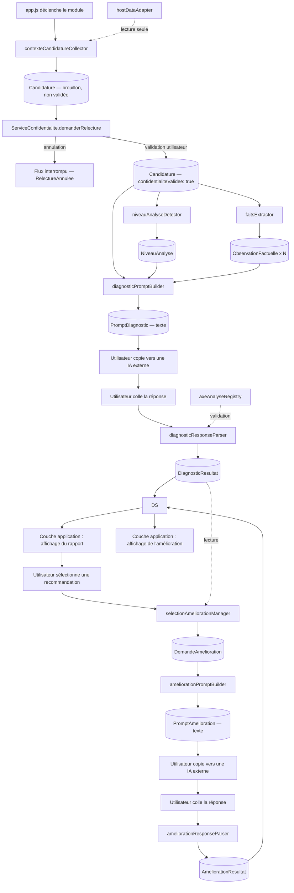
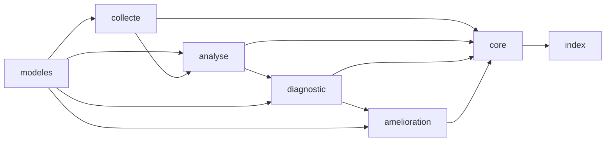

# Architecture technique — Module « Bilan de candidature »

> Spécification technique pré-implémentation. Aucun code. Ce document précise, jusqu'au niveau fichier, ce qui a été posé dans [ARCHITECTURE_MODULE_BILAN_CANDIDATURE.md](../../docs/ARCHITECTURE_MODULE_BILAN_CANDIDATURE.md), à la lumière de ce qui a été appris depuis (Prompt 1 V2, référentiel des règles, audit). Il vit dans le dossier du module lui-même, pas dans `docs/` : le jour où le module est extrait vers une autre application, ce fichier part avec le code.

---

## Étape 1 — Arborescence complète

```
modules/
  bilan-candidature/
    ARCHITECTURE_TECHNIQUE.md      → ce document

    index.js                        → façade publique — seul fichier importé par app.js

    core/
      moduleOrchestrator.js         → séquence les étapes, expose l'API publique du module
      diagnosticStore.js            → état central, seule source de vérité, cache, invalidation

    collecte/                        → COUCHE TERMINÉE, testée (15 tests)
      hostDataAdapter.js            → réutilise texteProfilEffectif('cv')/posteCibleActuel()/entrepriseCibleActuelle()/extraireDonneesCV (js/app.js, modules/cv-core) ; offreEmploi confirmé absent de l'app hôte (seul un lien existe, jamais le texte) — reste une saisie libre transmise par l'appelant. Expose aussi bilanLireDonneesStructureesAnalyse() (experiencesDates en années) — réservé à analyse/faitsExtractor.js, jamais dans Candidature ni envoyé au Prompt 1 (coordonnées retirées le 2026-08-10, plus aucun consommateur : le CV envoyé au Prompt 1 ne les a de toute façon jamais contenues)
      relectureConfidentialite.js   → local au module — réutilise ouvrirFenetreERIP/fermerFenetreERIP/htmlDeclencheurDemoVideo('masquage-texte')/echapperAttribut (js/app.js), aucune nouvelle primitive d'affichage
      contexteCandidatureCollector.js → assemble Candidature ; retourne toujours une Promise, jamais de throw synchrone mélangé à un rejet asynchrone

    analyse/                         → COUCHE TERMINÉE, testée (27 tests)
      axeAnalyseRegistry.js         → catalogue statique des 10 dimensions, exactement aligné sur prompts/bilan-v1.md (poids, niveau minimum) ; Projection recruteur volontairement absente (synthèse, pas une dimension)
      niveauAnalyseDetector.js      → détermine le niveau d'analyse (1 à 4) atteignable ; chaque niveau défini par sa propre donnée, pas cumulativement (une offre suffit pour le niveau 3, indépendamment de metierVise)
      faitsExtractor.js             → calcule les observations factuelles — périmètre V1 réduit à 1 observation (cohérence des dates ; coordonnées retiré le 2026-08-10, voir docs/PHILOSOPHIE_EVALUATION_BILAN_CANDIDATURE.md), architecture en registre de détecteurs extensible (BILAN_DETECTEURS_FAITS) : ajouter une observation en V2 = ajouter un détecteur, jamais réécrire l'orchestration. Dates en années seules (app hôte) : un chevauchement n'est signalé qu'en cas d'inclusion complète d'une période dans une autre, jamais deux périodes simplement consécutives

    diagnostic/                      → COUCHE TERMINÉE, testée (28 tests)
      promptTemplateLoader.js       → 100% générique (bilanResoudrePlaceholders ne connaît aucun nom de placeholder) + bilanChargerTemplate(cheminFichier, lecteur) — cache PAR CHEMIN (corrigé le 2026-08-08 : un chemin fixe aurait forcé core/ à contourner la limitation pour charger aussi prompts/bilan-v2.md), même convention fetch que chargerPromptsExternes() (js/app.js) ; échec jamais mis en cache
      diagnosticPromptBuilder.js    → seule couche connaissant les noms réels des placeholders ; vérifie confidentialiteValidee de façon indépendante (2e niveau de protection, cf. CONTRATS.md invariant 11)
      diagnosticResponseParser.js   → réutilise extraireBlocJSONDepuisTexte (js/app.js, exportée pour les tests) ; parser tolérant — chaque entrée d'axe/recommandation/alerte reconstruite indépendamment, jamais tout-ou-rien ; corrige silencieusement niveauAnalyse (jamais la valeur échoée par l'IA) et l'invariant 7 (jamais 'pret' si une alerte survit)

    amelioration/                    → COUCHE TERMINÉE, testée (26 tests). Prompt 2 = prompts/bilan-v2.md
      selectionAmeliorationManager.js → construit une DemandeAmelioration depuis un Diagnostic COMPLET (pas DiagnosticResultat seul — correction de contrat, cf. ARCHITECTURE_PROMPT2) + un id de recommandation ; résout observationsLiees depuis les deux sources (contexteAnalyse.observations + resultat.axes[].observationsArgumentees)
      ameliorationPromptBuilder.js    → réutilise bilanResoudrePlaceholders et bilanFormaterValeurOptionnelle/bilanFormaterObservationsDeterministes de diagnostic/, aucune duplication
      ameliorationResponseParser.js   → réutilise extraireBlocJSONDepuisTexte ; pas de anomalies[] ici (relation 1:1, un seul objet à construire — décision explicite de ne pas reprendre ce mécanisme sans besoin démontré) ; demandeAmeliorationId/recommandationId toujours pris de la DemandeAmelioration, jamais de la réponse IA

    modeles/                         → COUCHE TERMINÉE, testée (65 tests, node --test tests/*.test.js)
      enums.js                       → valeurs autorisées, une seule source pour toutes les énumérations ; inclut BILAN_TYPES_ANOMALIE (PascalCase, ajouté pendant diagnostic/)
      utilitaires.js                 → génération d'id, hash de contenu, erreurs métier nommées (§4 de CONTRATS.md)
      anomalie.js                    → ajouté pendant diagnostic/ : outil de diagnostic technique du parser tolérant, jamais une seconde représentation des données consommée ailleurs
      candidature.js
      contexteAnalyse.js
      observation.js
      attente.js                     → 🗺️ ajouté chantier "Carte de correspondance" (2026-08-19) — sous-structure du résultat de l'axe adequation, résolution texte→id dans diagnosticResponseParser.js, jamais dans ce fichier
      axe.js                         → forme d'une entrée de catalogue (donnée réelle des 10 axes : analyse/axeAnalyseRegistry.js)
      recommandation.js
      diagnostic.js
      diagnosticResultat.js          → inclut la forme du "résultat d'axe" et, depuis diagnostic/, celle d'une "alerte prioritaire" (sous-structures)
      demandeAmelioration.js
      propositionAmelioration.js
```

**Hors périmètre, volontairement.** Aucun fichier de rendu/affichage n'apparaît ici : la construction du HTML du rapport reste dans la couche application, comme pour les autres modules existants (`cv-editor`, `lettre-editor`). Le module produit des données structurées ; il ne les met jamais en forme visuelle lui-même. Si l'extraction vers une plateforme dédiée l'exige un jour, un dossier `presentation/` pourra s'ajouter sans toucher au reste.

**Points de couplage avec l'extérieur du module, exhaustifs :** `collecte/hostDataAdapter.js` (lecture des données de l'application actuelle) et `index.js` (point d'entrée appelé par `app.js`). Aucun autre fichier du module ne doit importer quoi que ce soit d'autre hors de son propre dossier.

> **Amendement — étape de confidentialité (révisé le 2026-08-08).** Le CV doit être relu et validé par l'utilisateur avant toute construction de prompt. Décision stratégique : cette logique est implémentée **localement** dans `collecte/` (pas de dépendance à un service transversal externe — `modules/confidentialite/` reste à l'état de contrat différé, voir [CONTRAT.md](../confidentialite/CONTRAT.md)), pour livrer la V1 avec un minimum d'impact sur l'application existante. Voir [CONTRATS.md](CONTRATS.md) pour le détail (objet `Candidature.confidentialiteValidee`, erreur `RelectureNonValidee`). Une extraction vers un module partagé pourra être envisagée plus tard, seulement si plusieurs parcours convergent vers le même besoin.

---

## Étape 2 — Flux de données



**Lecture séquentielle correspondante :**

1. **Entrée** — `app.js` invoque `index.js`, qui délègue à `moduleOrchestrator`.
2. **Collecte** — `contexteCandidatureCollector` lit le CV actif via `hostDataAdapter` et récupère la saisie libre (métier visé, offre, entreprise ciblée) → produit une `Candidature` **brouillon**, non encore validée.
3. **Confidentialité, étape obligatoire** — `ServiceConfidentialite.demanderRelecture({ type: 'texte', contenu: candidature.cv })` affiche le texte à l'utilisateur pour relecture/modification ; le flux s'arrête ici tant que l'utilisateur n'a pas validé explicitement (ou s'interrompt sur `RelectureAnnulee`). Une fois validée, `Candidature.confidentialiteValidee` passe à `true`.
4. **Transformation déterministe** — `niveauAnalyseDetector` produit `NiveauAnalyse` ; `faitsExtractor` produit les `ObservationFactuelle`. Ces deux composants ne s'exécutent jamais avant l'étape 3. *(Mise en cache par hash volontairement retirée du périmètre V1, décision du 2026-08-08 : `faitsExtractor` ne fait que 2 vérifications triviales — recalculer systématiquement coûte moins cher qu'ajouter une décision de cache dans `moduleOrchestrator`. À réintroduire seulement si un besoin réel apparaît.)*
5. **Envoi au Prompt 1** — `diagnosticPromptBuilder` vérifie `Candidature.confidentialiteValidee === true` (sinon `RelectureNonValidee`), assemble `Candidature` + `NiveauAnalyse` + `ObservationFactuelle[]` dans le template chargé par `promptTemplateLoader`, produit le texte complet du `PromptDiagnostic`.
6. **Sortie utilisateur** — le texte est affiché avec une action de copie ; l'IA externe n'est jamais appelée par l'application elle-même.
7. **Retour utilisateur** — le texte collé par l'utilisateur entre dans `diagnosticResponseParser`, qui le valide contre `axeAnalyseRegistry` (identifiants de dimension connus, énumérations respectées) et produit un `DiagnosticResultat` structuré — ou un état d'échec de parsing explicite, jamais un plantage silencieux.
8. **État** — `DiagnosticResultat` est écrit dans `diagnosticStore`, seule source lue par la couche d'affichage.
9. **Affichage** — hors périmètre technique de ce module (voir étape 1) ; consomme uniquement `diagnosticStore`.
10. **Amélioration ciblée** — la sélection utilisateur passe par `selectionAmeliorationManager`, qui construit `DemandeAmelioration` à partir du `DiagnosticResultat` déjà stocké, jamais en relisant le CV.
11. **Prompt 2** — même logique de construction/copie/collage/parsing que le Prompt 1, isolée dans `amelioration/`. Le CV a déjà été validé à l'étape 3 ; les objectifs saisis librement par l'utilisateur à cette étape ne repassent pas par une seconde relecture (saisie directe, pas un import).

---

## Étape 3 — Interfaces entre composants

### Principe de dépendance à sens unique



Aucune flèche ne remonte : `modeles/` ne dépend de rien dans le module, `core/` dépend de tout, `index.js` ne dépend que de `core/`. C'est la structure qui interdit mécaniquement toute dépendance circulaire.

**Règle de découplage entre étapes voisines.** Un composant reçoit toujours l'objet déjà construit par le composant précédent **en paramètre** ; il n'appelle jamais lui-même ce composant précédent. Exemple : `diagnosticPromptBuilder` reçoit un `ContexteCandidature`, un `NiveauAnalyse` et des `ObservationFactuelle[]` déjà prêts — il n'importe ni `contexteCandidatureCollector`, ni `niveauAnalyseDetector`, ni `faitsExtractor`. Seul `moduleOrchestrator` connaît l'ordre d'appel et fait circuler les objets.

### Responsabilité unique par fichier

| Fichier | Prend en entrée | Produit | Ne fait jamais |
|---|---|---|---|
| `hostDataAdapter` | rien (lit l'app hôte) | données brutes du dossier candidat | interpréter ou transformer ces données |
| `contexteCandidatureCollector` | données brutes + saisie libre | `ContexteCandidature` | déterminer un niveau ou extraire une observation |
| `niveauAnalyseDetector` | `ContexteCandidature` | `NiveauAnalyse` | calculer une observation factuelle |
| `axeAnalyseRegistry` | rien (catalogue statique) | définitions des 10 dimensions | dépendre d'un contexte candidat précis |
| `faitsExtractor` | `ContexteCandidature` | `ObservationFactuelle[]` | juger, interpréter, prioriser |
| `promptTemplateLoader` | un chemin de fichier (`prompts/bilan-v1.md` ou `prompts/bilan-v2.md`) | texte du template, en cache par chemin | connaître le contenu d'un contexte candidat |
| `diagnosticPromptBuilder` | contexte + niveau + observations | `PromptDiagnostic` | appeler une IA, interpréter une réponse |
| `diagnosticResponseParser` | texte brut collé | `DiagnosticResultat` ou erreur de format | générer du contenu, corriger un JSON invalide en l'inventant |
| `selectionAmeliorationManager` | `DiagnosticResultat` + sélection utilisateur | `DemandeAmelioration` | modifier le diagnostic déjà stocké |
| `ameliorationPromptBuilder` | `DemandeAmelioration` | `PromptAmelioration` | relire le CV ou le diagnostic complet |
| `ameliorationResponseParser` | texte brut collé | `AmeliorationResultat` ou erreur de format | recalculer une priorité ou une dimension |
| `diagnosticStore` | tous les objets produits | état lu/écrit | contenir une logique métier propre |
| `moduleOrchestrator` | événements de la couche application | séquencement des appels | contenir une règle du référentiel métier |

### Points explicites contre la duplication de traitement

- **`axeAnalyseRegistry` est l'unique source du poids et du niveau minimum d'une dimension.** `niveauAnalyseDetector` (pour filtrer), `diagnosticResponseParser` (pour valider les `id` reçus) et tout calcul futur de priorité l'interrogent — aucun n'encode sa propre copie de cette table.
- **`faitsExtractor` est rappelé à chaque fois, sans cache** (décision du 2026-08-08, vérifiée avant `core/`) : ses 2 observations V1 sont assez triviales pour que le recalcul coûte moins cher qu'une décision de cache dans `moduleOrchestrator`. Un cache par `hashContenu` reste possible plus tard, seulement si `faitsExtractor` s'alourdit réellement.
- **`promptTemplateLoader` lit chaque fichier de prompt une seule fois par chemin** et le garde en mémoire ; `diagnosticPromptBuilder`/`ameliorationPromptBuilder` ne relisent jamais le disque à chaque appel.

---

## Étape 4 — Objets manipulés

Structures de référence, pas d'implémentation. Le `DiagnosticResultat` reprend **exactement** le schéma de sortie du Prompt 1 V2 ([prompts/bilan-v1.md](../../prompts/bilan-v1.md)) — aucun champ ajouté ou retiré par rapport à ce que l'IA produit réellement.

- **`ContexteCandidature`** — `cv`, `metierVise`, `offreEmploi`, `entrepriseCiblee`, `lettreMotivation` *(futur)*, `preparationEntretien` *(futur)*, `dateDerniereMaj`, `hashContenu`.
- **`NiveauAnalyse`** — `niveau` (1-4), `donneesDisponibles[]`, `donneesManquantes[]`.
- **`AxeDefinition`** *(catalogue statique, `axeAnalyseRegistry`)* — `id`, `nom`, `poids` (`determinant`/`differenciateur`/`amplificateur`/`contextuel`), `niveauMinimum`, `plafonneA` *(optionnel, ex. `a_renforcer`)*.
- **`ObservationFactuelle`** — `id`, `categorie`, `contenu`, `sourcesDonnees[]`, `hashContexteSource`.
- **`PromptDiagnostic`** — `id`, `texte`, `niveau`, `dateGeneration`, `hashContexteUtilise`.
- **`DiagnosticResultat`** *(= sortie JSON du Prompt 1, telle quelle)* :
  - `metaDiagnostic` : `niveauAnalyse`, `dimensionsNonEvaluables[]` (`dimension`, `donneeManquante`)
  - `alertesPrioritaires[]` : `id`, `type`, `description`, `dimensionLiee`
  - `syntheseGenerale` : `statutPreparation`, `resumeNarratif`
  - `premiereImpression`, `ceQuiDonneEnvie`, `ceQuiPeutFreiner` : `{ texte }`
  - `axes[]` : `id`, `restitutionQualitative`, `observationsArgumentees[]` (`texte`, `observationsFactuellesLiees[]`), `pointsForts[]`, `pointsFaibles[]`, `incoherences[]`, `risques[]`, `attentes[]` 🗺️ (`contenu`, `observationsLiees[]` — ids déjà résolus, voir `CONTRATS.md`)
  - `recommandations[]` : `id`, `contenu`, `dimensionsLiees[]`, `priorite`, `extraitConcerne`, `observationsLiees[]`
  - `planAction[]` (identifiants de recommandations)
  - `syntheseProjectionRecruteur` : `{ texte }`
  - `texteBrutReponseIA` *(conservé côté store pour traçabilité, jamais affiché)*
- **`DemandeAmelioration`** — `id`, `recommandationSelectionnee` (objet complet extrait de `DiagnosticResultat.recommandations`), `objectifs[]`, `dateCreation`.
- **`PromptAmelioration`** — `id`, `texte`, `demandeAmeliorationId`, `dateGeneration`.
- **`AmeliorationResultat`** — `id`, `demandeAmeliorationId`, `ameliorationsCiblees[]` (`recommandationId`, `proposition`, `justification`, `actionsConcretes[]`), `texteBrutReponseIA`.
- **`EtatModule`** *(porté par `diagnosticStore`)* — `contexteCandidature`, `niveauAnalyse`, `observationsFactuelles[]`, `diagnosticResultat`, `demandesAmelioration[]`, `ameliorationResultats[]`.

---

## Étape 5 — Rappel du principe pour la suite

Cette architecture validée, chaque fichier de la section « Étape 1 » devient une unité de développement et de test indépendante, dans l'ordre des couches de dépendance (étape 3) : `modeles/` puis `collecte/` puis `analyse/` puis `diagnostic/` puis `amelioration/` puis `core/` puis `index.js`. Aucun fichier n'importe quoi que ce soit hors de `modules/bilan-candidature/` à l'exception de `hostDataAdapter.js` — c'est cette règle, tenue tout au long du développement, qui garantit l'extraction facile posée comme objectif.
